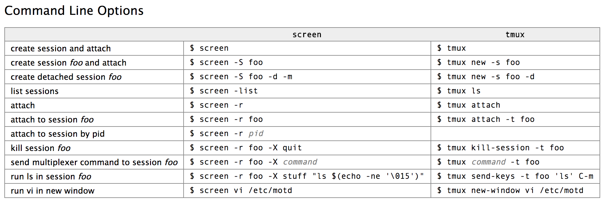

## linux notes

##### 1. Find

```bash
find $dir -name $name
locate 
# < is STDIN, > is STDOUT
grep something <somefile 

# match separate word
grep -w word

# find out port of what process is listening 
sudo lsof -iTCP -sTCP:LISTEN | grep mongo

# ? for a single character, [abc] for either a, b or c, ^ begin with something
#
ls -d ???^[ABC]*

# find process
ps -ef | grep mongo

# history number and !num to re-exec it
history
!256
```

##### 2. find out path

```bash
type $var
which $var
pwd
```

##### 3. pipe

```bash
# find process
ps -ef | grep mongo
```

##### 4. Direct run remote cmd by ssh

```bash
ssh $remote_host "$bash_cmd"
```

##### 5. tmux and screen cmd



##### 6. STDIN, STDOUT, STDERR

```bash
grep something <somefile
grep something <somefile >resultfile 2>errorfile

#Say you want to redirect both STDOUT and STDERR to the same file. Then you cannot do. This redirects STDOUT (1) to the ‘resultfile’ and tells STDERR (2) to send the output to what STDOUT is set to (also ‘resultfile’).
grep something >resultfile 2>&1
```

##### 7. Sort, wc, awk, less, head, tail

```bash
grep
#Filters out lines with certain search words. “grep -v” searches for all lines that do not contain the search word.

sort
#Sort the output alphabetically (needs to wait until EOF before doing its work). “sort -n” sorts numerically. “sort -u” filters out duplicate lines.usel

wc
#Word count. Counts the bytes, words and lines. “wc -l” just outputs how many lines were counted.

awk
#A sophisticated language (similar to Perl) that can be used to do something with every line. “awk ‘{print $3}'” outputs the third column of every line.

sed (stream editor)
#A search/replace tool to change something in every line.

less
#Useful at the end of a pipe. Allows you to browse through the output one page at a time. (“less” refers to a similar but less capable tool called “more” that allowed you to see the first page and then press ‘Space’ to view ‘more’.)

head
#Shows the first ten lines only. “head -50” shows the first 50 lines.

tail
#Shows the last ten lines only. “tail -50” shows the last 50 lines. “tail -f” follows a certain file.
```

##### 8. chmod

```bash
# read 4, write 2, execute 1
# 7 = rwx, 
# 6 = rw-, 
# 5 = r-x, 
# 4 = r--, 
# 3 = -wx, 
# 2 = -w-,
# 1 = --x, 
# 0 = ---
# a = all, u = user owner, g = group owner, o = other, 
chmod 540 file # user, group, other
chmod u+w file
```

##### 9. tar

```bash
# compress
tar -cvf name.tar /path/to/dir

# extrat file from tar
tar -xf name.tar

# unzip tar.gz
tar -xvzf name.tar.gz
```

